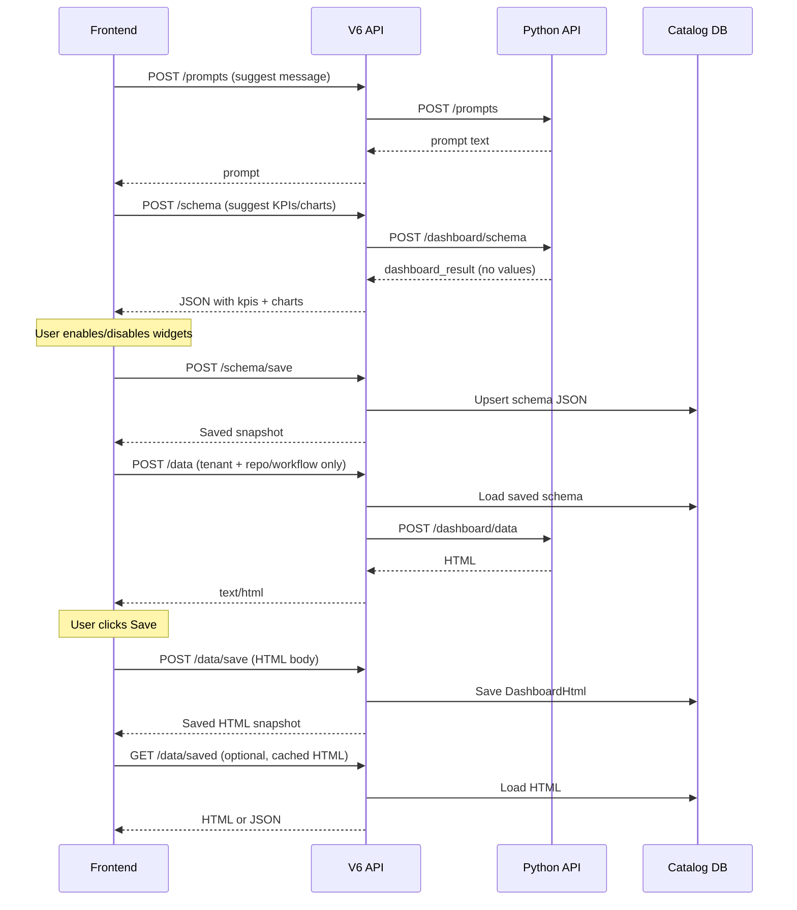

# Dashboard API ó Frontend Integration Guide

V6 proxies dashboard **schema** and **data** calls to the Python service and persists the edited schema + rendered HTML in the **catalog database** (PostgreSQL table `catalog."DashboardSchemaSnapshots"`) per tenant + repository/workflow.

## Base URL & auth

| Item | Value |
|------|--------|
| Base path | `/V6API` (IIS path base) |
| API prefix | `/api/dashboard` |
| Full example | `https://demo.ezofis.com/V6API/api/dashboard/schema` |
| Auth | `Authorization: Bearer <JWT>` (TenantUser) |
| Tenant header | `X-Tenant-Id: <guid>` (optional if JWT contains tenant) |
| Content-Type | `application/json` for POST bodies |

Both **snake_case** (`tenant_id`) and **camelCase** (`tenantId`) are accepted on request bodies.

---

## Recommended flow
Result



---

## Endpoints

| # | Method | Path | Purpose |
|---|--------|------|---------|
| 0 | `POST` | `/api/dashboard/prompts` | Suggest a natural-language dashboard `message` |
| 1 | `POST` | `/api/dashboard/schema` | AI-suggest KPIs & charts (no live values) |
| 2 | `POST` | `/api/dashboard/schema/save` | Save edited schema to catalog DB |
| 3 | `PUT` | `/api/dashboard/schema/save` | Same as POST (upsert) |
| 4 | `GET` | `/api/dashboard/schema/saved` | Load saved schema from catalog DB |
| 5 | `POST` | `/api/dashboard/data` | Hydrate schema Gùù HTML (does **not** save) |

**HTML persistence:**

| Method | Path | Purpose |
|--------|------|---------|
| `POST` / `PUT` | `/api/dashboard/data/save` | Save HTML when user clicks Save |
| `GET` | `/api/dashboard/data/saved` | Load cached HTML without calling Python |

---

## 0. POST `/api/dashboard/prompts`

Suggest one natural-language prompt from repository/workflow metadata. Proxies Python `POST {ApiBaseUrl}/prompts`.

Use the returned `prompt` as `message` on `POST /api/dashboard/schema`.

### Request body

| Field | Required | Notes |
|-------|----------|--------|
| `tenant_id` | Yes* | Tenant UUID (*from JWT if omitted) |
| `repository_id` | One of | Repository UUID |
| `workflow_id` | One of | Resolves repository from workflow when repo omitted |
| `session_id` | No | Defaults to `demo` |
| `repository_name` | No | Optional hint |
| `workflow_name` | No | Optional hint |

### Example

```json
{
  "session_id": "demo",
  "tenant_id": "3EE0E334-CCB9-4DFF-968A-9BAAE71A5231",
  "repository_id": "ade27d62-7f09-4b9f-8562-8f8b059bbf3b",
  "workflow_id": "b05ed64d-7c94-4ecd-a5b0-caa5839757f9"
}
```

### Response (`200`)

```json
{
  "session_id": "demo",
  "prompt": "Recommend KPIs for vessel call dashboard with total files, verified files, and file type distribution.",
  "correlation_id": "a667fd4a-9865-4200-b8d3-09765eb44147",
  "latency_ms": 1820.4,
  "tenant_id": "3EE0E334-CCB9-4DFF-968A-9BAAE71A5231",
  "repository_id": "ade27d62-7f09-4b9f-8562-8f8b059bbf3b",
  "repository_name": "Shipping Agency Files",
  "workflow_id": "b05ed64d-7c94-4ecd-a5b0-caa5839757f9",
  "workflow_name": "Vessel Call",
  "table": "repository.Items_ade27d62"
}
```

---

## 1. POST `/api/dashboard/schema`

Suggest KPI and chart widgets for a repository or workflow. Response contains **structure only** (`data: null` inside `dashboard_result`) Gùù no numeric values.

### Request body

| Field | Type | Required | Description |
|-------|------|----------|-------------|
| `session_id` | string | **Yes** | Chat/session id (e.g. `"demo"`). Do not use Swagger placeholder `"string"`. |
| `message` | string | No | User prompt, e.g. `"Recommend KPIs for vessel call dashboard"` |
| `tenant_id` | guid | Yes* | Tenant id (*filled from JWT if omitted) |
| `repository_id` | guid | One of | Repository to analyze |
| `workflow_id` | guid | One of | Workflow to analyze |

### Example request

```json
{
  "session_id": "demo",
  "message": "Recommend KPIs for vessel call dashboard",
  "tenant_id": "3EE0E334-CCB9-4DFF-968A-9BAAE71A5231",
  "repository_id": "ade27d62-7f09-4b9f-8562-8f8b059bbf3b",
  "workflow_id": "b05ed64d-7c94-4ecd-a5b0-caa5839757f9"
}
```

### Example response (`200`, `application/json`)

```json
{
  "session_id": "demo",
  "reply": "Suggested dashboard. Enable or disable widgets, then send this JSON back.",
  "correlation_id": "55ae1892-51c3-4f8d-9996-c6a02dc8c934",
  "latency_ms": 8225.7,
  "dashboard_result": {
    "phase": "schema",
    "workflow": "shipping_agency_files",
    "tenant_id": "3ee0e334-ccb9-4dff-968a-9baae71a5231",
    "repository_id": "ade27d62-7f09-4b9f-8562-8f8b059bbf3b",
    "repository_name": "Shipping Agency Files",
    "workflow_id": "b05ed64d-7c94-4ecd-a5b0-caa5839757f9",
    "message": "Recommend for vessel call dashboard",
    "kpis": [
      {
        "id": "total_files",
        "label": "Total Files",
        "description": "This KPI measures the total number of files.",
        "enabled": true,
        "agg": "count",
        "columns": { "value": "Id" },
        "order": 1,
        "position": "top",
        "color": "#7c5cff"
      }
    ],
    "charts": [
      {
        "id": "file_type_distribution",
        "label": "File Type Distribution",
        "title": "File Type Distribution",
        "type": "donut",
        "enabled": true,
        "agg": "count",
        "grain": "none",
        "columns": { "group": "FileType" },
        "order": 1,
        "position": "full",
        "color": "#7c5cff",
        "span": 2
      }
    ],
    "data": null
  },
  "html": null
}
```

### Frontend notes

- Use `dashboard_result.kpis` and `dashboard_result.charts` to render the widget picker.
- Let the user toggle `enabled` on each KPI/chart before saving.
- Keep the full `dashboard_result` object for the save step.

### Errors

| Status | Meaning |
|--------|---------|
| `400` | Missing `session_id`, `tenant_id`, or repo/workflow id |
| `502` | Python service unreachable |
| `504` | Python timeout |

---

## 2 & 3. POST / PUT `/api/dashboard/schema/save`

Save the edited dashboard schema (KPIs + charts) to catalog DB. **Upserts** Gùù same tenant + `repository_id` (or `workflow_id`) updates the existing row.

`POST` and `PUT` behave the same.

### Request body

| Field | Type | Required | Description |
|-------|------|----------|-------------|
| `tenant_id` | guid | Yes* | Tenant id |
| `repository_id` | guid | One of | Scope key |
| `workflow_id` | guid | One of | Scope key |
| `dashboard_json` | object | One of | Full `dashboard_result` object |
| `dashboard_result` | object | One of | Alias for `dashboard_json` (from schema API response) |

Pass either `dashboard_json` or `dashboard_result` Gùù not as an escaped string; send as a **JSON object**.

### Example request

```json
{
  "tenantId": "3ee0e334-ccb9-4dff-968a-9baae71a5231",
  "repositoryId": "ade27d62-7f09-4b9f-8562-8f8b059bbf3b",
  "workflowId": "b05ed64d-7c94-4ecd-a5b0-caa5839757f9",
  "dashboard_result": {
    "phase": "schema",
    "workflow": "shipping_agency_files",
    "message": "Recommend for vessel call dashboard",
    "kpis": [ "..." ],
    "charts": [ "..." ]
  }
}
```

### Example response (`200`, `application/json`)

```json
{
  "tenantId": "3ee0e334-ccb9-4dff-968a-9baae71a5231",
  "repositoryId": "ade27d62-7f09-4b9f-8562-8f8b059bbf3b",
  "workflowId": "b05ed64d-7c94-4ecd-a5b0-caa5839757f9",
  "schemaJson": "{...}",
  "dashboardHtml": null,
  "createdAtUtc": "2026-09-02T10:57:27.512Z",
  "modifiedAtUtc": "2026-09-02T10:57:27.512Z",
  "htmlModifiedAtUtc": null
}
```

> `schemaJson` is returned as a JSON **string** in the API response. Parse it if you need an object.

### Errors

| Status | Meaning |
|--------|---------|
| `400` | Missing tenant, scope, or `dashboard_json` / `dashboard_result` |

---

## 4. GET `/api/dashboard/schema/saved`

Load a previously saved schema from catalog DB.

### Query parameters

| Param | Type | Required | Description |
|-------|------|----------|-------------|
| `tenantId` | guid | Yes* | Tenant id |
| `repositoryId` | guid | One of | Lookup by repository |
| `workflowId` | guid | One of | Lookup by workflow |

### Example

```
GET /V6API/api/dashboard/schema/saved?tenantId=3ee0e334-ccb9-4dff-968a-9baae71a5231&repositoryId=ade27d62-7f09-4b9f-8562-8f8b059bbf3b
```

### Response

Same shape as **schema/save** response (`200`). Returns `404` if no saved schema exists.

---

## 5. POST `/api/dashboard/data`

Hydrate enabled widgets with live data. Returns **embeddable HTML** (`text/html`).

- `session_id` is **not required** (V6 defaults to `"default"` for Python).
- If `dashboard_json` is omitted, V6 loads the saved schema from catalog DB.
- HTML is **not** auto-saved. Call `POST /data/save` when the user clicks Save.

### Request body

| Field | Type | Required | Description |
|-------|------|----------|-------------|
| `tenant_id` | guid | Yes* | Tenant id |
| `repository_id` | guid | One of | Scope |
| `workflow_id` | guid | One of | Scope |
| `session_id` | string | No | Optional |
| `dashboard_json` | object | No | Override saved schema (full `dashboard_result`) |

### Minimal example (uses saved schema)

```json
{
  "tenantId": "3ee0e334-ccb9-4dff-968a-9baae71a5231",
  "repositoryId": "ade27d62-7f09-4b9f-8562-8f8b059bbf3b",
  "workflowId": "b05ed64d-7c94-4ecd-a5b0-caa5839757f9"
}
```

### Example with inline schema

```json
{
  "tenantId": "3ee0e334-ccb9-4dff-968a-9baae71a5231",
  "repositoryId": "ade27d62-7f09-4b9f-8562-8f8b059bbf3b",
  "dashboard_json": {
    "phase": "schema",
    "kpis": [ "..." ],
    "charts": [ "..." ]
  }
}
```

### Response (`200`, `text/html`)

Raw HTML string (includes `<style>` + `<div class="ez-dash">`). Render with:

```javascript
const html = await response.text();
document.getElementById('dashboard-container').innerHTML = html;
```

### Errors

| Status | Meaning |
|--------|---------|
| `400` | Missing tenant or repo/workflow id |
| `404` | No saved schema and no `dashboard_json` in body |
| `502` | Python service error |
| `504` | Timeout |

---

## 6. POST / PUT `/api/dashboard/data/save`

Explicitly save dashboard HTML to catalog DB. Call this **only when the user clicks Save**.

`POST` and `PUT` behave the same.

### Request body

| Field | Type | Required | Description |
|-------|------|----------|-------------|
| `tenant_id` | guid | Yes* | Tenant id |
| `repository_id` | guid | One of | Scope |
| `workflow_id` | guid | One of | Scope |
| `dashboard_html` | string | Yes | Full HTML from `POST /data` (`html` / `dashboardHtml` aliases accepted) |

### Example request

```json
{
  "tenantId": "3ee0e334-ccb9-4dff-968a-9baae71a5231",
  "repositoryId": "ade27d62-7f09-4b9f-8562-8f8b059bbf3b",
  "workflowId": "b05ed64d-7c94-4ecd-a5b0-caa5839757f9",
  "dashboardHtml": "<style>...</style><div class=\"ez-dash\">...</div>"
}
```

### Example response (`200`)

```json
{
  "tenantId": "3ee0e334-ccb9-4dff-968a-9baae71a5231",
  "repositoryId": "ade27d62-7f09-4b9f-8562-8f8b059bbf3b",
  "workflowId": "b05ed64d-7c94-4ecd-a5b0-caa5839757f9",
  "dashboardHtml": "<style>...</style><div class=\"ez-dash\">...</div>",
  "htmlModifiedAtUtc": "2026-09-03T05:00:00.000Z"
}
```

### Errors

| Status | Meaning |
|--------|---------|
| `400` | Missing tenant, scope, or `dashboard_html` |

---

## 7. GET `/api/dashboard/data/saved`

Load cached HTML without calling Python (use after a successful `POST /data`).

### Query parameters

| Param | Type | Required |
|-------|------|----------|
| `tenantId` | guid | Yes* |
| `repositoryId` | guid | One of |
| `workflowId` | guid | One of |
| `raw` | bool | No Gùù if `true`, returns `text/html` directly |

### JSON response (`200`)

```json
{
  "tenantId": "3ee0e334-ccb9-4dff-968a-9baae71a5231",
  "repositoryId": "ade27d62-7f09-4b9f-8562-8f8b059bbf3b",
  "workflowId": "b05ed64d-7c94-4ecd-a5b0-caa5839757f9",
  "dashboardHtml": "<style>...</style><div class=\"ez-dash\">...</div>",
  "htmlModifiedAtUtc": "2026-09-02T11:30:00.000Z"
}
```

### Raw HTML

```
GET /V6API/api/dashboard/data/saved?tenantId=...&repositoryId=...&raw=true
```

---

## Frontend checklist

1. **Schema step** Gùù `POST /schema` with `session_id` + tenant + repo/workflow.
2. **Edit widgets** Gùù toggle `enabled` on KPIs/charts in `dashboard_result`.
3. **Persist schema** Gùù `POST /schema/save` with `dashboard_result`.
4. **Render live data** Gùù `POST /data` with tenant + repo/workflow only (preview only).
5. **Save HTML** Gùù `POST /data/save` when user clicks Save, passing the HTML from step 4.
6. **Cache read** Gùù `GET /data/saved` on page load to avoid re-calling Python.
7. **Re-fetch live** Gùù `POST /data` when user clicks Refresh (still does not save until Save).

---

## Storage (catalog DB)

Table: `catalog.DashboardSchemaSnapshots`

| Column | Description |
|--------|-------------|
| `SchemaJson` | Saved KPI/chart schema |
| `DashboardHtml` | HTML saved only via `POST /data/save` |
| `HtmlModifiedAtUtc` | When HTML was last updated |

One active row per **tenant + repository** (or **tenant + workflow**).

---

## TypeScript types (reference)

```typescript
interface DashboardSchemaRequest {
  session_id: string;
  message?: string;
  tenant_id?: string;
  repository_id?: string;
  workflow_id?: string;
}

interface DashboardKpi {
  id: string;
  label: string;
  description?: string;
  enabled: boolean;
  agg: 'count' | 'sum' | 'avg' | string;
  columns: { value: string };
  order: number;
  position: string;
  color: string;
}

interface DashboardChart {
  id: string;
  label: string;
  title?: string;
  description?: string;
  type: 'pie' | 'donut' | 'line' | 'bar' | string;
  enabled: boolean;
  agg: string;
  grain: string;
  columns: { group: string };
  order: number;
  position: string;
  color: string;
  span?: number;
}

interface DashboardResult {
  phase: string;
  workflow?: string;
  tenant_id?: string;
  repository_id?: string;
  repository_name?: string;
  workflow_id?: string;
  message?: string;
  kpis: DashboardKpi[];
  charts: DashboardChart[];
  data: null;
}

interface SchemaApiResponse {
  session_id: string;
  reply: string;
  correlation_id: string;
  latency_ms: number;
  dashboard_result: DashboardResult;
  html: null;
}

interface SaveSchemaRequest {
  tenantId: string;
  repositoryId?: string;
  workflowId?: string;
  dashboard_result?: DashboardResult;
  dashboard_json?: DashboardResult;
}

interface SavedSchemaResponse {
  tenantId: string;
  repositoryId?: string;
  workflowId?: string;
  schemaJson: string; // parse with JSON.parse()
  dashboardHtml?: string | null;
  createdAtUtc: string;
  modifiedAtUtc?: string;
  htmlModifiedAtUtc?: string | null;
}

interface DataRequest {
  tenantId: string;
  repositoryId?: string;
  workflowId?: string;
  session_id?: string;
  dashboard_json?: DashboardResult;
}
```

---

## Sample `fetch` calls

```javascript
const base = 'https://demo.ezofis.com/V6API/api/dashboard';
const headers = {
  'Content-Type': 'application/json',
  Authorization: `Bearer ${token}`,
  'X-Tenant-Id': tenantId,
};

// 1. Suggest schema
const schemaRes = await fetch(`${base}/schema`, {
  method: 'POST',
  headers,
  body: JSON.stringify({
    session_id: 'demo',
    message: 'Recommend KPIs for vessel call dashboard',
    tenant_id: tenantId,
    repository_id: repositoryId,
    workflow_id: workflowId,
  }),
});
const schema = await schemaRes.json();

// 2. Save edited schema
await fetch(`${base}/schema/save`, {
  method: 'POST',
  headers,
  body: JSON.stringify({
    tenantId,
    repositoryId,
    workflowId,
    dashboard_result: schema.dashboard_result,
  }),
});

// 3. Get live HTML (preview Gùù not saved)
const dataRes = await fetch(`${base}/data`, {
  method: 'POST',
  headers,
  body: JSON.stringify({ tenantId, repositoryId, workflowId }),
});
const html = await dataRes.text();
container.innerHTML = html;

// 4. Save HTML only when user clicks Save
await fetch(`${base}/data/save`, {
  method: 'POST',
  headers,
  body: JSON.stringify({ tenantId, repositoryId, workflowId, dashboardHtml: html }),
});

// 5. Load cached HTML later
const cached = await fetch(
  `${base}/data/saved?tenantId=${tenantId}&repositoryId=${repositoryId}&raw=true`,
  { headers: { Authorization: `Bearer ${token}` } }
);
container.innerHTML = await cached.text();
```
