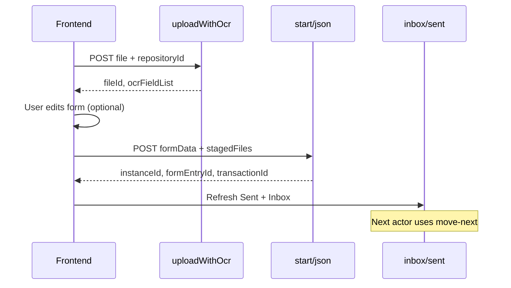

# Normal Workflow Start — Frontend Guide

**Audience:** Frontend  
**Last updated:** August 2026

Start a **normal** workflow (no dedicated AP Agent step) with optional pre-ticket OCR upload, form data, and staged files. After start, the ticket advances from **START** to the next step (e.g. Manager) and appears in **Sent** (initiator) and **Inbox** (assignee).

AP Agent workflows (workflow contains a step with `stageType: AP_AGENT` or name `Ap Agent`) keep the existing start + Python job behavior.

---

## 1. Flow overview



| Step | API | Purpose |
|------|-----|---------|
| 1 | `POST /api/uploadAndIndex/uploadWithOcr` | Stage file + OCR (pre-ticket); returns `fileId` |
| 2 | `POST /api/workflows/{workflowId}/start/json` | Create instance, apply form, archive staged files, open next step |
| 3 | Inbox / Sent | Initiator sees Sent; assignee sees Inbox |
| 4 | `POST /api/workflows/instances/{instanceId}/move-next` | Approvers advance the chain (existing API) |

All routes require:

```http
Authorization: Bearer {jwt}
```

Tenant comes from JWT / tenant context (same as other workflow APIs).

---

## 2. Pre-ticket upload with OCR

Stage a file **before** starting the workflow. The file stays in monitor/stage storage until start promotes it into the repository archive.

```http
POST /api/uploadAndIndex/uploadWithOcr
Content-Type: multipart/form-data
Authorization: Bearer {jwt}
```

### Form fields

| Field | Required | Notes |
|-------|----------|--------|
| `file` | Yes | Document to upload |
| `repositoryId` | Yes | Target repository GUID |
| `filename` | No | Override display name |
| `fields` | No | OCR field hints (repeatable form key) |
| `pageNo` | No | OCR page hint |
| `ocrType` | No | OCR engine hint |
| `validateType` | No | Validation hint |

### Sample response `200`

```json
{
  "fileId": "3fa85f64-5717-4562-b3fc-2c963f66afa6",
  "repositoryId": "6dcebb44-2942-4ed3-beb6-dbd937e97d5f",
  "fileName": "requisition.pdf",
  "filePath": "monitor/.../requisition.pdf",
  "ocrJson": "{ ... }",
  "ocrFieldList": [
    { "name": "RequesterName", "value": "Jane Doe", "type": "text" },
    { "name": "Amount", "value": "1500.00", "type": "number" }
  ]
}
```

Use `fileId` + `repositoryId` in the start payload. Map `ocrFieldList` into your form UI; user edits before submit.

**Multiple files:** call `uploadWithOcr` once per file; pass all pairs in `stagedFiles` at start.

---

## 3. Start workflow (JSON)

Preferred for normal workflows when files were staged via `uploadWithOcr`.

```http
POST /api/workflows/{workflowId}/start/json
Content-Type: application/json
Authorization: Bearer {jwt}
```

### Request body

```json
{
  "context": "IT requisition from portal",
  "envType": "trial",
  "formData": {
    "RequesterName": "Jane Doe",
    "Department": "IT",
    "Amount": "1500.00",
    "lineItems": [
      { "Description": "Laptop", "Qty": "1", "Cost": "1500.00" }
    ]
  },
  "stagedFiles": [
    {
      "repositoryId": "6dcebb44-2942-4ed3-beb6-dbd937e97d5f",
      "fileId": "3fa85f64-5717-4562-b3fc-2c963f66afa6"
    }
  ]
}
```

| Property | Required | Notes |
|----------|----------|--------|
| `context` | No | Free-text context stored on the instance |
| `envType` | No | Defaults to server config (`trial`) |
| `formData` | No | Same shape as move-next `formData` (flat fields + optional `lineItems` array) |
| `stagedFiles` | No | Array of `{ repositoryId, fileId }` from `uploadWithOcr` |
| `attachment` | No | Base64 inline file (legacy); prefer `stagedFiles` for normal flow |

`formData` field names must match the workflow form (ezfb) field ids/names.

### Multipart alternative

```http
POST /api/workflows/{workflowId}/start
Content-Type: multipart/form-data
```

| Form field | Notes |
|------------|--------|
| `formData` | JSON **string** (same object as above) |
| `fileIds` | JSON **string** — array of `{ repositoryId, fileId }` |
| `file` | Optional legacy direct upload (flat repository path) |
| `context`, `envType` | Same as JSON start |

### Sample response `201`

Standard `StartWorkflowCommandResult` — includes `instanceId`, reference number, and bootstrap metadata (`formEntryId`, transaction ids, etc.). Refresh inbox/sent after success.

---

## 4. What the backend does on normal start

When the workflow has **no** dedicated AP Agent step:

1. Inserts ezfb form entry and applies `formData` to form fields.
2. Completes **START** with review `Submit` and opens the **next** step from `ActionsJson` / step order (e.g. Manager).
3. Promotes each `stagedFiles` entry: archive → `WorkflowAttachments` → `processAddon` (one row per file; `ProcessId` = instance GUID).
4. Links `processForm` and re-syncs mailbox rows so **Sent** and **Inbox** show form + file metadata.

No AP Agent Python job is enqueued unless the workflow definition includes a dedicated AP Agent step **and** a direct file attachment is provided on start.

---

## 5. After start — move-next

Approvers use the existing move-next API (same as other workflows):

```http
POST /api/workflows/instances/{instanceId}/move-next
Content-Type: application/json
Authorization: Bearer {jwt}
```

```json
{
  "activityid": "{activityId-from-inbox-row}",
  "review": "Approve",
  "comments": "Looks good",
  "formData": {
    "ManagerNotes": "Approved for Q3 budget"
  }
}
```

| `review` | Typical use |
|----------|-------------|
| `Submit` | First action from START (handled automatically on start for normal flow) |
| `Approve` | Approve current step |
| `Reject` | Send to rejected branch |
| `Satisfied` | Condition / satisfaction path |

Read `activityId` from the inbox row. Routing follows the published workflow designer (`WorkflowSteps` + `ActionsJson`).

See also: [`FRONTEND_TEAM_API_GUIDE.md`](./FRONTEND_TEAM_API_GUIDE.md) (inbox/sent, bulk move-next) and [`TEAM_API_GUIDE_CREDITS_AND_WORKFLOW_SHARE.md`](./TEAM_API_GUIDE_CREDITS_AND_WORKFLOW_SHARE.md) (shared verify flow).

---

## 6. Normal vs AP Agent start

| | Normal workflow | AP Agent workflow |
|--|-----------------|-------------------|
| Detection | No step with `AP_AGENT` / name `Ap Agent` | Has dedicated AP Agent step |
| Pre-upload | `uploadWithOcr` → `stagedFiles` | Optional; start file triggers Python job |
| On start | Form apply + START Submit + next human step | START → AP Agent step active |
| Python job | Not enqueued | Enqueued when file attached at start |

---

## 7. FE checklist

- [ ] Publish workflow before start (`POST /api/workflows/{id}/publish`).
- [ ] For attachments: `uploadWithOcr` per file → collect `repositoryId` + `fileId`.
- [ ] Start via `start/json` with `formData` and `stagedFiles`.
- [ ] On success, refresh **Sent** (initiator) and **Inbox** (next assignee).
- [ ] Store `instanceId`, `formEntryId`, and inbox `activityId` for move-next.
- [ ] Use move-next with correct `review` per step actions (Approve / Reject / Satisfied).

---

## 8. Error cases

| HTTP | Cause |
|------|--------|
| `400` | Missing file on upload; invalid `repositoryId`; malformed `formData` / `fileIds` JSON |
| `404` | Unknown workflow or staged `fileId` |
| `401` / `403` | Missing or insufficient auth |

Invalid `formData` on multipart start throws `Invalid formData JSON: ...` before instance creation.
