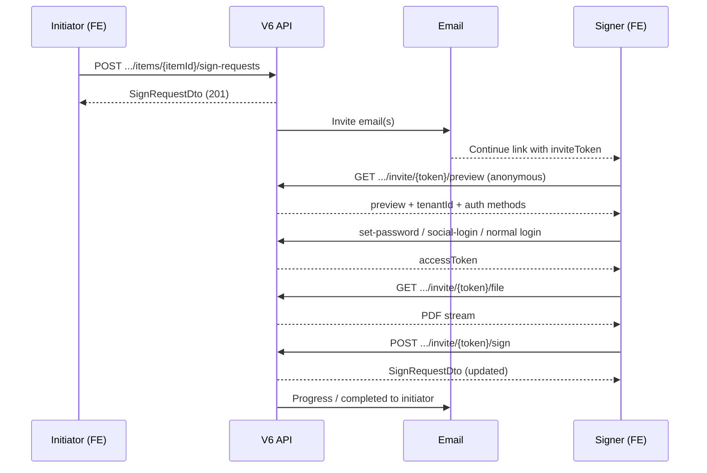

# Repository Sign Request — Frontend Guide

**Audience:** Frontend team  
**Last updated:** July 2026  
**Base URL examples:** `https://localhost:44311` · `https://your-host/V6API`

Send this document to FE for implementing the full sign-request UX.

---

## Table of contents

1. [What the product does](#1-what-the-product-does)
2. [High-level flow (diagrams)](#2-high-level-flow-diagrams)
3. [Statuses & enums](#3-statuses--enums)
4. [Common headers & auth rules](#4-common-headers--auth-rules)
5. [Initiator flow (step by step)](#5-initiator-flow-step-by-step)
6. [Signer Path A — email invite link](#6-signer-path-a--email-invite-link)
7. [Signer Path B — normal login (no invite token)](#7-signer-path-b--normal-login-no-invite-token)
8. [Sign anywhere (PDF coordinates)](#8-sign-anywhere-pdf-coordinates)
9. [API reference — full input / output](#9-api-reference--full-input--output)
10. [Error responses](#10-error-responses)
11. [FE screens & checklist](#11-fe-screens--checklist)
12. [Suggested routes](#12-suggested-routes)
13. [API config (backend)](#13-api-config-backend)

---

## 1. What the product does

1. Initiator selects a **PDF** repository file and one or more signers.
2. Chooses **parallel** or **sequential** signing.
3. Each pending signer gets an ezofis email (“Do you recognize this document?”) with a **Continue** link.
4. Signer opens the link → verifies details → logs in (set password / social / existing login) → opens PDF → **places signature anywhere**.
5. Backend stamps the signature onto the PDF and **overwrites the same repository file** (same name / path).
6. Initiator gets progress emails and a **completed** email when all signers finish.

**v1 constraint:** PDF files only.

---

## 2. High-level flow (diagrams)

### 2.1 End-to-end



### 2.2 Which path should FE use?

```text
User opens app
        │
        ├─ URL has /sign-request/{inviteToken}  →  Path A (invite APIs)
        │
        └─ Already logged in (no invite token)  →  Path B (pending-for-me)
```

| Path | When | Token needed? |
|------|------|----------------|
| **A** | Signer clicks email Continue link | Yes — `inviteToken` |
| **B** | Existing user logs in normally | No — use `signRequestId` + JWT email |

---

## 3. Statuses & enums

### Sign request status (`status`)

| Value | Meaning |
|-------|---------|
| `InProgress` | Waiting for one or more signers |
| `Completed` | All required signers signed |
| `Cancelled` | Initiator cancelled, or a signer declined |
| `Expired` | Past `expiresAtUtc` |

### Signer status (`signers[].status` / `signerStatus`)

| Value | Meaning |
|-------|---------|
| `Waiting` | Sequential mode — not their turn yet (no invite email yet) |
| `Pending` | Their turn / invited — can open file and sign |
| `Signed` | Already signed |
| `Declined` | Declined; request becomes `Cancelled` |

### Signing mode (`signingMode`)

| Value | Behavior |
|-------|----------|
| `parallel` | All signers emailed immediately; any can sign in any order |
| `sequential` | Only order `1` emailed first; next signer invited after previous signs |

---

## 4. Common headers & auth rules

| Call type | `Authorization` | `X-Tenant-Id` |
|-----------|-----------------|---------------|
| Create / list / get / cancel | Bearer JWT (initiator) | **Required** |
| Preview invite | None | Not required |
| Set-password / social (invite) | None | **Not** sent — tenant comes from token |
| Invite file / sign / decline | Bearer JWT (signer) | Optional (tenant already known from invite) |
| Pending-for-me / file / sign / decline by id | Bearer JWT (signer) | **Required** |

**Important:** JWT email must match the signer email on the request.

JSON property names are **camelCase**.

---

## 5. Initiator flow (step by step)

### Step I1 — User picks a PDF file

FE already has `repositoryId` + `itemId` from repository browse.

Show UI:

- Signer list (email + optional name + order)
- Mode toggle: Parallel / Sequential
- Optional message
- Optional expiry days (default 14)

### Step I2 — Create sign request

```http
POST /api/repositories/{repositoryId}/items/{itemId}/sign-requests
Authorization: Bearer {jwt}
X-Tenant-Id: {tenantId}
Content-Type: application/json
```

**Input**

```json
{
  "signingMode": "sequential",
  "message": "Please sign this invoice",
  "expiresInDays": 14,
  "signers": [
    { "email": "alice@company.com", "name": "Alice", "order": 1 },
    { "email": "bob@company.com", "name": "Bob", "order": 2 }
  ]
}
```

| Field | Type | Required | Notes |
|-------|------|----------|-------|
| `signingMode` | string | Yes | `"parallel"` or `"sequential"` |
| `signers` | array | Yes | At least 1 |
| `signers[].email` | string | Yes | Unique per request |
| `signers[].name` | string | No | Display name |
| `signers[].order` | number | No | 1-based; sequential uses this |
| `message` | string | No | Shown in email + preview |
| `expiresInDays` | number | No | Default from API config |

**Single signer example**

```json
{
  "signingMode": "sequential",
  "signers": [
    { "email": "alice@company.com", "name": "Alice", "order": 1 }
  ]
}
```

**Output `201 Created`** — see [SignRequestDto](#91-shared-dto--signrequestdto)

Store `signRequestId` for status polling / cancel.

### Step I3 — Show status tracker

Poll or refresh:

```http
GET /api/sign-requests/{signRequestId}
```

or list all for the file:

```http
GET /api/repositories/{repositoryId}/items/{itemId}/sign-requests
```

Render each signer as Waiting / Pending / Signed / Declined.

### Step I4 — Cancel (optional)

```http
POST /api/sign-requests/{signRequestId}/cancel
Authorization: Bearer {jwt}
X-Tenant-Id: {tenantId}
```

**Output `200`** — updated `SignRequestDto` with `status: "Cancelled"`.

---

## 6. Signer Path A — email invite link

### Email Continue URL (backend builds this)

```text
{FrontendBaseUrl}{SignRequestPath}/{inviteToken}?email={urlencodedEmail}&isnew={true|false}
```

Example (new user — must set password):

```text
https://demoapp.ezofis.com/sign-request/a1b2c3d4...?email=alice%40company.com&isnew=true
```

Example (existing user — normal login):

```text
https://demoapp.ezofis.com/sign-request/a1b2c3d4...?email=bob%40company.com&isnew=false
```

| Query | Meaning | FE action |
|-------|---------|-----------|
| `isnew=true` | New / incomplete guest (no password yet) | Show **set password** (and/or social first-time) |
| `isnew=false` | Existing user already has password or social | Show **login** (skip set-password) |
| `email` | Signer email | Prefill / match JWT after auth |

```js
const inviteToken = /* from route */;
const email = params.get("email");
const isNew = params.get("isnew") === "true";
```

Prefer preview API as source of truth too: `requiresPasswordSetup` === `isnew` (same meaning).  
FE route should parse `inviteToken`, `email`, and `isnew`.

---

### Step A1 — Preview (anonymous landing page)

```http
GET /api/sign-requests/invite/{inviteToken}/preview
```

No auth. No body.

**Output `200`**

```json
{
  "inviteToken": "a1b2c3d4...",
  "signRequestId": "11111111-1111-1111-1111-111111111111",
  "tenantId": "0822952c-aaaa-bbbb-cccc-ddddeeeeffff",
  "repositoryId": "22222222-2222-2222-2222-222222222222",
  "itemId": "33333333-3333-3333-3333-333333333333",
  "fileName": "INV-2026-6001_v20.pdf",
  "sourceOrganizationName": "Aravinthan S",
  "senderName": "Aravinthan S",
  "senderEmail": "aravinthan.s@ezofis.com",
  "recipientEmail": "alice@company.com",
  "signingMode": "sequential",
  "signerOrder": 1,
  "signerCount": 2,
  "signerStatus": "Pending",
  "signRequestStatus": "InProgress",
  "expiresAtUtc": "2026-08-13T10:00:00Z",
  "requiresLogin": true,
  "requiresPasswordSetup": true,
  "requiredSocialProvider": null,
  "allowedAuthMethods": ["password", "google", "microsoft"],
  "loginType": null,
  "message": "Please sign this invoice"
}
```

| Field | FE use |
|-------|--------|
| `tenantId` | Store for later API calls / session |
| `allowedAuthMethods` | Which login buttons to show |
| `requiresPasswordSetup` | Show “set password” form for new guest |
| `requiredSocialProvider` | Force Google/Microsoft if set |
| Document / sender fields | DocuSign-style verify card |

If `404` → show “Invite not found or expired”.

---

### Step A2 — Authenticate

Use URL `isnew` (or preview `requiresPasswordSetup`):

| `isnew` / `requiresPasswordSetup` | Screen |
|-----------------------------------|--------|
| `true` | **Set password** (`POST /api/auth/sign-request/set-password`) and/or social first-time |
| `false` | **Login** with existing password/social (skip set-password) |

#### A2a — New user: set password (`isnew=true`)

```http
POST /api/auth/sign-request/set-password
Content-Type: application/json
```

**Input**

```json
{
  "inviteToken": "a1b2c3d4...",
  "email": "alice@company.com",
  "password": "SecurePass123!"
}
```

**Do not send `X-Tenant-Id`.**

**Output `200`**

```json
{
  "userId": "44444444-4444-4444-4444-444444444444",
  "accessToken": "eyJhbGciOi...",
  "tokenType": "Bearer",
  "expiresIn": 3600
}
```

#### A2b — Social login

```http
POST /api/auth/sign-request/social-login
Content-Type: application/json
```

**Input**

```json
{
  "inviteToken": "a1b2c3d4...",
  "email": "alice@company.com",
  "provider": "google"
}
```

`provider`: `"google"` | `"microsoft"` | `"office365"`

**Output:** same `LoginSuccess` shape as set-password.

#### A2c — Existing user already has password

Use normal tenant login (`POST /api/auth/login` with `X-Tenant-Id: preview.tenantId`), then continue with invite file/sign APIs. Email in JWT must equal `recipientEmail`.

**After auth, persist:**

```text
accessToken  ← response.accessToken
tenantId     ← preview.tenantId
inviteToken  ← from URL
```

---

### Step A3 — Open PDF (inline view or download)

Same pattern as repository `.../file?disposition=`:

```http
GET /api/sign-requests/invite/{inviteToken}/file?disposition=inline
Authorization: Bearer {accessToken}
```

```http
GET /api/sign-requests/invite/{inviteToken}/file?disposition=attachment
Authorization: Bearer {accessToken}
```

| `disposition` | Behavior |
|---------------|----------|
| `inline` (default) | View in browser / PDF viewer (`Content-Disposition: inline`) |
| `attachment` | Force download with filename |

**Output `200`:** binary PDF stream (`Content-Type: application/pdf`). Range requests supported.

---

### Step A4 — Submit signature

```http
POST /api/sign-requests/invite/{inviteToken}/sign
Authorization: Bearer {accessToken}
Content-Type: application/json
```

**Input**

```json
{
  "pageNumber": 1,
  "x": 120.5,
  "y": 440.2,
  "width": 160,
  "height": 48,
  "signatureImageBase64": "data:image/png;base64,iVBORw0KGgo...",
  "signedAtClientUtc": "2026-07-30T05:30:00Z"
}
```

| Field | Type | Required | Notes |
|-------|------|----------|-------|
| `pageNumber` | int | Yes | 1-based |
| `x`, `y` | number | Yes | Top-left of box, PDF points |
| `width`, `height` | number | Yes | Box size, PDF points |
| `signatureImageBase64` | string | Yes | PNG/JPEG data-URL or raw base64 |
| `signedAtClientUtc` | string (ISO) | No | Client timestamp |

**Output `200`:** updated [SignRequestDto](#91-shared-dto--signrequestdto)

Show thank-you. If sequential, next signer is emailed automatically by API.

---

### Step A5 — Decline (optional)

```http
POST /api/sign-requests/invite/{inviteToken}/decline
Authorization: Bearer {accessToken}
Content-Type: application/json
```

**Input**

```json
{
  "reason": "Not my document"
}
```

`reason` optional — `{}` is valid.

**Output `200`:** `SignRequestDto` with request `Cancelled` and this signer `Declined`.

---

## 7. Signer Path B — normal login (no invite token)

Use when the signer is already a tenant user and opens the app without the email URL.

### Step B1 — List my pending signatures

```http
GET /api/sign-requests/pending-for-me
Authorization: Bearer {jwt}
X-Tenant-Id: {tenantId}
```

**Output `200`** — array of:

```json
[
  {
    "signRequestId": "11111111-1111-1111-1111-111111111111",
    "repositoryId": "22222222-2222-2222-2222-222222222222",
    "itemId": "33333333-3333-3333-3333-333333333333",
    "fileName": "INV-2026-6001_v20.pdf",
    "signingMode": "sequential",
    "status": "InProgress",
    "signerStatus": "Pending",
    "signerOrder": 1,
    "message": "Please sign this invoice",
    "senderName": "Aravinthan S",
    "senderEmail": "aravinthan.s@ezofis.com",
    "expiresAtUtc": "2026-08-13T10:00:00Z",
    "createdAtUtc": "2026-07-30T05:00:00Z",
    "inviteToken": "a1b2c3d4..."
  }
]
```

| Field | Notes |
|-------|--------|
| `signRequestId` | Use for Path B file/sign/decline |
| `inviteToken` | Optional deep-link if FE still wants Path A |
| `signerStatus` | Only actionable when `Pending` |

### Step B2 — Open PDF (inline view or download)

```http
GET /api/sign-requests/{signRequestId}/file?disposition=inline
Authorization: Bearer {jwt}
X-Tenant-Id: {tenantId}
```

```http
GET /api/sign-requests/{signRequestId}/file?disposition=attachment
Authorization: Bearer {jwt}
X-Tenant-Id: {tenantId}
```

Same `disposition` rules as Path A (`inline` = view, `attachment` = download).

**Output:** PDF stream.

### Step B3 — Sign

```http
POST /api/sign-requests/{signRequestId}/sign
Authorization: Bearer {jwt}
X-Tenant-Id: {tenantId}
Content-Type: application/json
```

**Input:** same body as Path A Step A4.

**Output `200`:** `SignRequestDto`.

### Step B4 — Decline

```http
POST /api/sign-requests/{signRequestId}/decline
Authorization: Bearer {jwt}
X-Tenant-Id: {tenantId}
Content-Type: application/json
```

**Input:** `{ "reason": "..." }` or `{}`.

**Output `200`:** `SignRequestDto`.

---

## 8. Sign anywhere (PDF coordinates)

```text
(0,0) ────────────────► x (points)
  │
  │     ┌──────────────┐
  │     │  signature   │  width × height
  │     └──────────────┘
  ▼
  y (points)
```

- Origin is **top-left** of the page.
- Units are **PDF points** (1/72 inch), same as most PDF viewers report.
- FE should convert viewer viewport → page points before calling `/sign`.
- Stamp **replaces** the repository file in place (same path/name).

---

## 9. API reference — full input / output

Replace placeholders:

| Placeholder | Meaning |
|-------------|---------|
| `{baseUrl}` | API host |
| `{jwt}` / `{accessToken}` | Bearer token |
| `{tenantId}` | Tenant GUID |
| `{repositoryId}` | Repository GUID |
| `{itemId}` | File item GUID |
| `{signRequestId}` | Sign request GUID |
| `{inviteToken}` | Opaque invite token from email / create response |

---

### 9.1 Shared DTO — `SignRequestDto`

Returned by create, get, list item, cancel, sign, decline.

```json
{
  "signRequestId": "11111111-1111-1111-1111-111111111111",
  "repositoryId": "22222222-2222-2222-2222-222222222222",
  "itemId": "33333333-3333-3333-3333-333333333333",
  "fileName": "INV-2026-6001_v20.pdf",
  "signingMode": "sequential",
  "status": "InProgress",
  "message": "Please sign this invoice",
  "initiatedByUserId": "55555555-5555-5555-5555-555555555555",
  "initiatedByEmail": "aravinthan.s@ezofis.com",
  "initiatedByName": "Aravinthan S",
  "expiresAtUtc": "2026-08-13T10:00:00Z",
  "createdAtUtc": "2026-07-30T05:00:00Z",
  "completedAtUtc": null,
  "signers": [
    {
      "signerId": "66666666-6666-6666-6666-666666666666",
      "email": "alice@company.com",
      "name": "Alice",
      "order": 1,
      "status": "Pending",
      "inviteUrl": "https://demoapp.ezofis.com/sign-request/a1b2c3d4...?email=alice%40company.com&isnew=true",
      "invitedAtUtc": "2026-07-30T05:00:00Z",
      "signedAtUtc": null
    },
    {
      "signerId": "77777777-7777-7777-7777-777777777777",
      "email": "bob@company.com",
      "name": "Bob",
      "order": 2,
      "status": "Waiting",
      "inviteUrl": null,
      "invitedAtUtc": null,
      "signedAtUtc": null
    }
  ]
}
```

| Field | Notes |
|-------|--------|
| `inviteUrl` | Present when that signer is (or was) invited; includes `?email=...&isnew=true|false` |
| `completedAtUtc` | Set when `status` becomes `Completed` |

---

### 9.2 Create

```http
POST {baseUrl}/api/repositories/{repositoryId}/items/{itemId}/sign-requests
Authorization: Bearer {jwt}
X-Tenant-Id: {tenantId}
Content-Type: application/json
```

**Input — sequential**

```json
{
  "signingMode": "sequential",
  "message": "Please sign this invoice",
  "expiresInDays": 14,
  "signers": [
    { "email": "alice@company.com", "name": "Alice", "order": 1 },
    { "email": "bob@company.com", "name": "Bob", "order": 2 }
  ]
}
```

**Input — parallel**

```json
{
  "signingMode": "parallel",
  "message": "Both of you please sign",
  "expiresInDays": 14,
  "signers": [
    { "email": "alice@company.com", "name": "Alice", "order": 1 },
    { "email": "bob@company.com", "name": "Bob", "order": 2 }
  ]
}
```

**Output:** `201` + `SignRequestDto`  
Location header: `/api/sign-requests/{signRequestId}`

---

### 9.3 List for file

```http
GET {baseUrl}/api/repositories/{repositoryId}/items/{itemId}/sign-requests
Authorization: Bearer {jwt}
X-Tenant-Id: {tenantId}
```

**Input:** none  
**Output `200`:** `SignRequestDto[]`

---

### 9.4 Get one

```http
GET {baseUrl}/api/sign-requests/{signRequestId}
Authorization: Bearer {jwt}
X-Tenant-Id: {tenantId}
```

**Input:** none  
**Output `200`:** `SignRequestDto`  
**Output `404`:** `{ "error": "Sign request not found." }`

---

### 9.5 Cancel

```http
POST {baseUrl}/api/sign-requests/{signRequestId}/cancel
Authorization: Bearer {jwt}
X-Tenant-Id: {tenantId}
```

**Input:** none  
**Output `200`:** `SignRequestDto`

---

### 9.6 Invite preview (anonymous)

```http
GET {baseUrl}/api/sign-requests/invite/{inviteToken}/preview
```

**Input:** none  
**Output `200`:** see Step A1  
**Output `404`:** `{ "error": "Sign invite not found or expired." }`

---

### 9.7 Auth — set password

```http
POST {baseUrl}/api/auth/sign-request/set-password
Content-Type: application/json
```

**Input**

```json
{
  "inviteToken": "a1b2c3d4...",
  "email": "alice@company.com",
  "password": "SecurePass123!"
}
```

**Output `200`**

```json
{
  "userId": "44444444-4444-4444-4444-444444444444",
  "accessToken": "eyJhbGciOi...",
  "tokenType": "Bearer",
  "expiresIn": 3600
}
```

---

### 9.8 Auth — social login

```http
POST {baseUrl}/api/auth/sign-request/social-login
Content-Type: application/json
```

**Input**

```json
{
  "inviteToken": "a1b2c3d4...",
  "email": "alice@company.com",
  "provider": "google"
}
```

**Output `200`:** same as 9.7

---

### 9.9 Path A — file / sign / decline

```http
GET  {baseUrl}/api/sign-requests/invite/{inviteToken}/file?disposition=inline
GET  {baseUrl}/api/sign-requests/invite/{inviteToken}/file?disposition=attachment
POST {baseUrl}/api/sign-requests/invite/{inviteToken}/sign
POST {baseUrl}/api/sign-requests/invite/{inviteToken}/decline
Authorization: Bearer {accessToken}
```

`disposition`: `inline` (default, view) or `attachment` (download) — same as repository file API.  
Sign body / decline body — see Steps A4 / A5.  
File → PDF stream. Sign/decline → `SignRequestDto`.

---

### 9.10 Path B — pending / file / sign / decline

```http
GET  {baseUrl}/api/sign-requests/pending-for-me
GET  {baseUrl}/api/sign-requests/{signRequestId}/file?disposition=inline
GET  {baseUrl}/api/sign-requests/{signRequestId}/file?disposition=attachment
POST {baseUrl}/api/sign-requests/{signRequestId}/sign
POST {baseUrl}/api/sign-requests/{signRequestId}/decline
Authorization: Bearer {jwt}
X-Tenant-Id: {tenantId}
```

Pending → `MyPendingSignRequestDto[]` (Step B1).  
File → PDF stream (`disposition` same as repository). Sign/decline → `SignRequestDto`.

---

## 10. Error responses

Most failures return:

```json
{
  "error": "Human-readable message"
}
```

| HTTP | Typical meaning |
|------|-----------------|
| `400` | Validation / wrong status (already signed, not your turn, not PDF, etc.) |
| `401` | Missing/invalid JWT, or JWT email ≠ signer email |
| `404` | Invite / request / file not found |
| `500` | Unexpected server error |

FE should surface `error` text to the user.

---

## 11. FE screens & checklist

### Screens

| Screen | Who | Notes |
|--------|-----|-------|
| Send for signature | Initiator | Mode + signers form on a PDF item |
| Sign request status | Initiator | Per-signer chips + cancel |
| Invite landing / verify | Signer | Preview details (DocuSign-style) |
| Auth (set password / social) | Signer | Reuse share-invite patterns |
| PDF sign canvas | Signer | Place signature image anywhere |
| Thank you / declined | Signer | After submit |
| Pending signatures inbox | Signer | Path B list from `pending-for-me` |

### Checklist

- [ ] Initiator: Parallel / Sequential + signer list  
- [ ] Initiator: status tracker (Waiting / Pending / Signed / Declined)  
- [ ] Route `/sign-request/:inviteToken`  
- [ ] Parse `email` + `isnew` from query (`isnew=true` → set password, `false` → login)  
- [ ] Anonymous preview page  
- [ ] Auth using `/api/auth/sign-request/*` (no `X-Tenant-Id`)  
- [ ] Persist `accessToken` + `tenantId` from preview  
- [ ] PDF viewer + drag/place signature  
- [ ] Path A file/sign/decline  
- [ ] Path B `pending-for-me` + file/sign/decline by id  
- [ ] FE rule: inviteToken in URL → A, else logged-in → B  
- [ ] Handle expired / cancelled / already signed  

---

## 12. Suggested routes

| Route | Purpose |
|-------|---------|
| `/repositories/:repositoryId/items/:itemId/send-for-signature` | Initiator create form |
| `/sign-requests/:signRequestId` | Initiator status |
| `/sign-request/:inviteToken` | Path A landing |
| `/sign-request/:inviteToken/sign` | Path A PDF + sign |
| `/inbox/signatures` | Path B pending list |
| `/sign-requests/:signRequestId/sign` | Path B PDF + sign |

---

## 13. API config (backend)

```json
"RepositorySignRequest": {
  "FrontendBaseUrl": "https://demoapp.ezofis.com",
  "SignRequestPath": "/sign-request",
  "DefaultExpiryDays": 14,
  "EmailSubjectPrefix": "Please review and sign",
  "SupportEmail": "support@ezofis.com"
}
```

Invite emails and completed emails include the ezofis logo and DocuSign-style detail blocks (Document name, Company, Sender, Sender Email). FE does not build those emails — API sends them.

---

## Quick decision tree (copy for FE)

```text
1. Creating a request?
   → POST /api/repositories/{repoId}/items/{itemId}/sign-requests

2. User opened email link?
   → GET preview → auth → GET invite/{token}/file → POST invite/{token}/sign

3. User logged in normally?
   → GET /api/sign-requests/pending-for-me
   → GET /api/sign-requests/{id}/file
   → POST /api/sign-requests/{id}/sign
```
